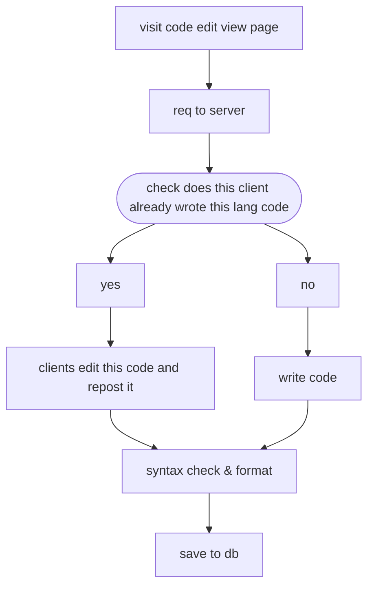

# Rule
- user can only write one code by one lang
- But user can rewrite them
---
## Flow of adding code

---
# The end point  "/author_code"
	param -> github uid

### What is this end point doing inside ?
This router is check are there any code which were written by this client(check with github uid)

### What does this end point return? 
This end point returns code data written by this client
*data sample* 

If there is no code written by client
```json
{
message: 'success',
status: 200,
exist: false,
code: {
  python: null,
  typescript: null,
  rust: null
  ...
}
}
```

If client already wrote *python code*
```json
{
message: 'success',
status: 200,
exist: true,
code: {
  python: {/*code data*/},
  typescript: {},
  rust: {}
  ...
}
```

If client doesn't exit in user db
```json
{
message: 'user not exist',
exist: false,
status: 404
)
```

