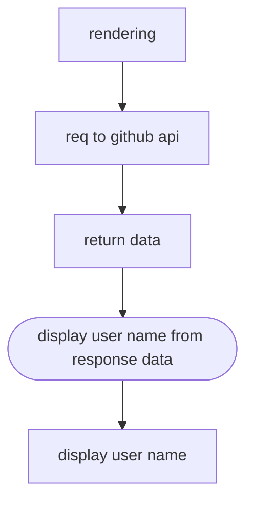

### doing while rendering

```mermaid
flowchart TB
    F[rendering] -->
    A[req to github api] --> B[return data] -->
    C([display user name from response data]) -->
     R[display user name]

```
